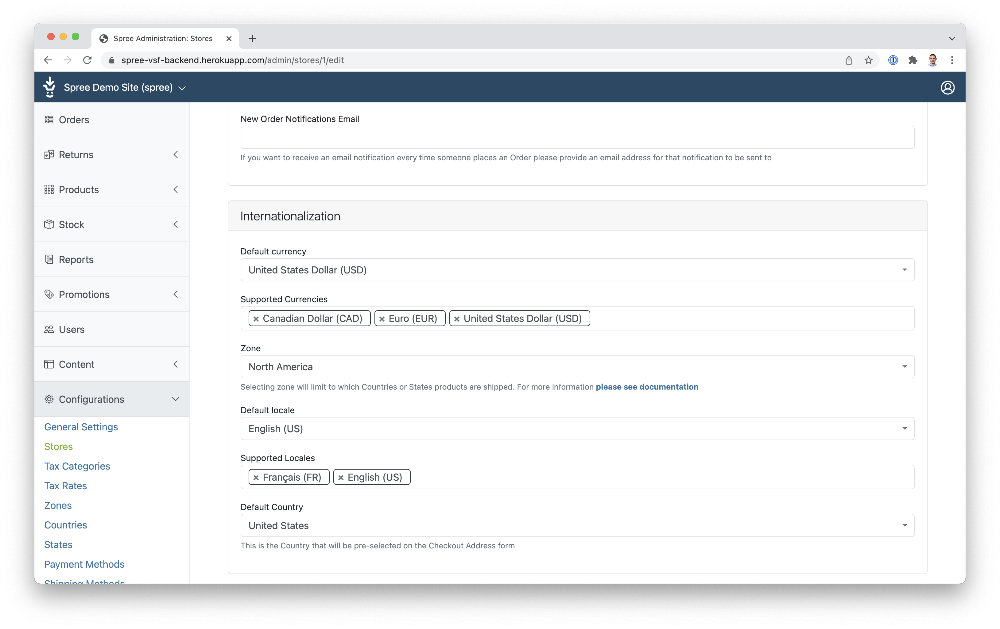

# Multi-currency support

Since 1.3.0, Spree + Vue Storefront integration supports multiple currencies natively.

By default, currencies in Spree don't depend on the customer's locale, as opposed to other VSF integrations.

This means that if your store is available in English and German, and supports USD and EUR, users using the store in German will be able to choose either USD or EUR as their currency. The same for users using the store in English. This allows for flexibility when catering to an international customer base.

To use multiple currencies, you'll need to set up available currencies both in Spree and in Vue Storefront.

## Enabling multiple currencies in Spree admin panel

As the first step, you'll need to configure available currencies in Spree's backend.

You can do that via the store's configuration page:


Then, you'll need to set prices in these currencies for products. When editing a product in Spree's admin panel, go to the "Prices" tab on the right and set prices for each currency.


When the customer chooses a given currency, they'll only see products that have a price set in that currency.

## Configuring available currencies in Vue Storefront

Next, you'll need to set up the currency in Vue Storefront's configuration.

Open `packages/theme/nuxt.config.js` and find the following definition:

```js
vueI18n: {
  silentTranslationWarn: true,
  fallbackLocale: 'en',
  numberFormats: {
    en: {
      currency: {
        style: 'currency',
        currency: 'USD',
        currencyDisplay: 'symbol',
        currencyDefault: 'USD'
      }
    },
    de: {
      currency: {
        style: 'currency',
        currency: 'EUR',
        currencyDisplay: 'symbol',
        currencyDefault: 'EUR'
      }
    }
  },
},
```

To add a new currency, you'll need to add its definition to the dictionary. After that, it will be visible in the currency switcher and available to the customer to use.
